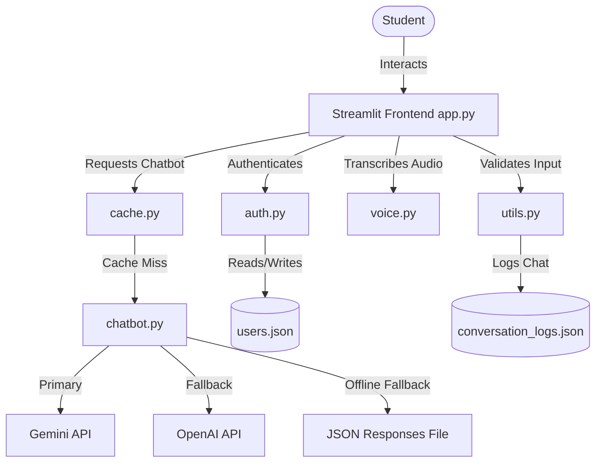

# AI-Powered Student Query Assistant

An interactive, production-ready study assistant for students. Built with **Streamlit**, **google-genai**, **OpenAI**, and **SpeechRecognition**, this application provides modular, tailored support across four key academic and professional tracks.

---

## 🚀 Features

1. **Academic Tracks**: Specialized prompts and guides for:
   - **Programming**: Concept learning, syntax explanations, code debugging, and PEP 8 guidelines.
   - **AI/ML**: Analogies, mathematics, and code blocks for ML/DL models and frameworks (PyTorch, Scikit-Learn).
   - **Career Guidance**: Tech roles breakdown, learning roadmaps, portfolio ideas, and resume tips.
   - **Interview Prep**: Algorithmic problem-solving (DSA), Big-O complexity feedback, and behavioral guidance (STAR method).
2. **User Authentication**: Secure signup and login flow with salt-hashed password storage (using Python's native `hashlib.pbkdf2_hmac` with 100,000 iterations of SHA-256).
3. **Session Management**: Independent multi-turn chat history preserved for each of the 4 tracks during a user session.
4. **Voice Input Feature**: Record queries directly in the browser. Voice commands are processed and transcribed using local `SpeechRecognition` library capabilities.
5. **Response Caching**: Computes cache hashes on user queries using `functools.lru_cache` to instantly return cached responses, saving API limits and costs.
6. **Robust Logging**: Comprehensive rotating app logging in `logs/app.log` utilizing `RotatingFileHandler`.
7. **Offline Mode**: Operates in full offline/dry-run mode matching query fragments against `test_data/sample_responses.json` if API keys are missing.
8. **Premium Styling**: Sleek, modern dark glassmorphism interface, custom gradients, and smooth responsive layouts.

---

## 🏛️ Architecture

The application implements a clean, modular Model-View-Controller style architecture where the frontend Streamlit UI handles presentation and routing while backend tasks are decoupled into specialized modules:



---

## 📁 Folder Structure

```
student-query-assistant/
├── app.py                     # Main Streamlit UI, session management, and routing
├── requirements.txt           # Python package dependencies
├── README.md                  # Project documentation (this file)
├── .env.example               # Template for environment credentials
│
├── modules/                   # Decoupled backend business logic
│   ├── __init__.py            # Module initializer
│   ├── auth.py                # File-based user authentication (JSON)
│   ├── cache.py               # Memory caching using functools.lru_cache
│   ├── chatbot.py             # Chatbot integrations (Gemini & OpenAI fallback)
│   ├── logger.py              # File-based logger setup (logs/app.log)
│   ├── voice.py               # Speech-to-text conversion (SpeechRecognition)
│   └── utils.py               # Input validation and conversation logging
│
├── data/                      # JSON persistent database (auto-seeded)
│   ├── users.json             # Local registered credentials
│   └── conversation_logs.json # Cumulative conversation history
│
├── test_data/                 # Mock and seed resources
│   ├── sample_users.json      # Mock credentials (test_student / securepassword123)
│   ├── sample_conversation_logs.json # Mock conversation history
│   ├── sample_queries.txt     # List of queries for validation testing
│   └── sample_responses.json  # Mock answers for offline testing
│
└── logs/                      # Application diagnostics
    └── app.log                # Current log history
```

---

## 🛠️ Environment Setup & Installation Steps

### Prerequisites
- Python **3.12.8** (tested and verified)
- Modern web browser (Chrome, Edge, or Safari for audio recording permissions)
- A **Gemini API Key** from [Google AI Studio](https://aistudio.google.com/)
- An **OpenAI API Key** (optional fallback)

### Step-by-Step Installation

1. **Position in the Project Root**
   ```powershell
   cd "your repo name"
   ```

2. **Create and Activate a Virtual Environment**
   ```powershell
   python -m venv .venv
   .venv\Scripts\Activate.ps1
   ```

3. **Install Dependencies**
   ```powershell
   python -m pip install -r requirements.txt
   ```

4. **Configure Environment Variables**
   Create a `.env` file in the root directory:
   ```env
   GEMINI_API_KEY=your_actual_gemini_api_key_here
   OPENAI_API_KEY=your_actual_openai_api_key_here
   ```
   *Note: If no API keys are specified in the `.env` file, they can be entered directly on the app's sidebar settings during runtime.*

---

## 🏃 Running Instructions

To launch the Streamlit application:
```powershell
streamlit run app.py
```
The server will spin up and automatically open a browser window pointing to `http://localhost:8501`.


---

## 🔧 Troubleshooting Guide

*   **No Module Named 'openai'**:
    Ensure the virtual environment is fully activated and dependencies are installed via `python -m pip install -r requirements.txt` rather than global pip.
*   **Voice Recognition Failed**:
    Make sure you have granted microphone permissions to the browser. If you get a service connection error, check your internet connectivity.
*   **Offline Mode Active Warning**:
    If both API keys are missing or invalid, the chatbot falls back to the local database mapping. Enter valid API keys in the sidebar to return live generative responses.
*   **Cache Notice Missing**:
    If a query has not been asked before, it is generated live and cached. Successive submissions of the exact same query in the same track will display the blue caching banner.

---

## 🔮 Future Enhancements

*   **Local LLaMA Integration**: Support local models using Ollama to run fully offline without any API keys.
*   **Export Formats**: Allow downloading conversation history as Markdown or PDF files in addition to JSON.
*   **Multi-lingual Audio**: Extend voice transcription to support Hindi, Spanish, and other language query translations.
